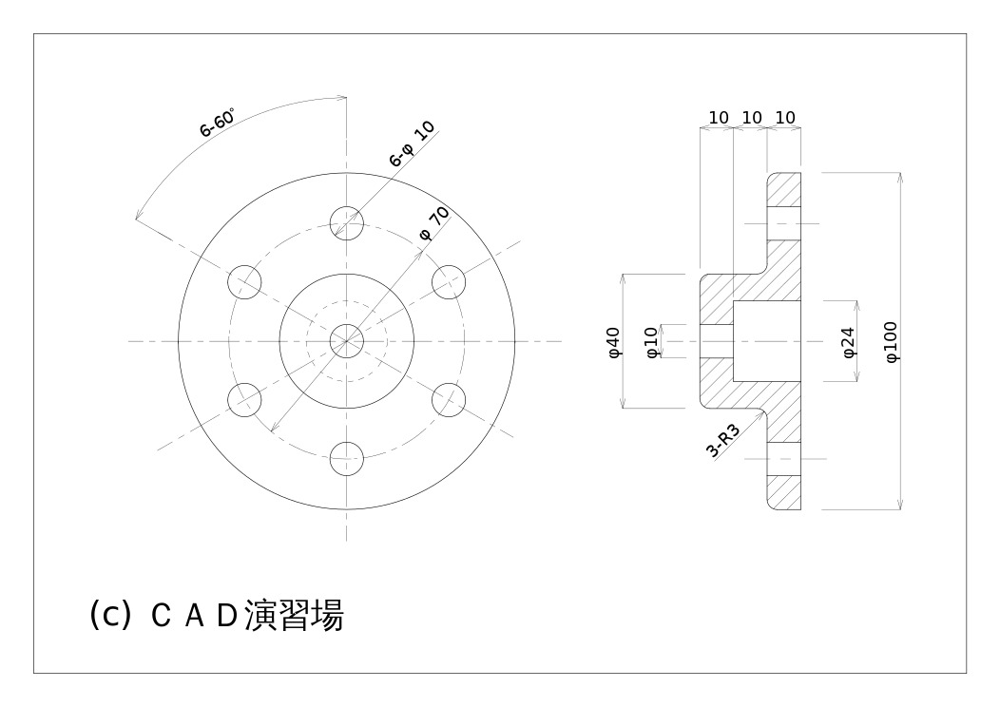
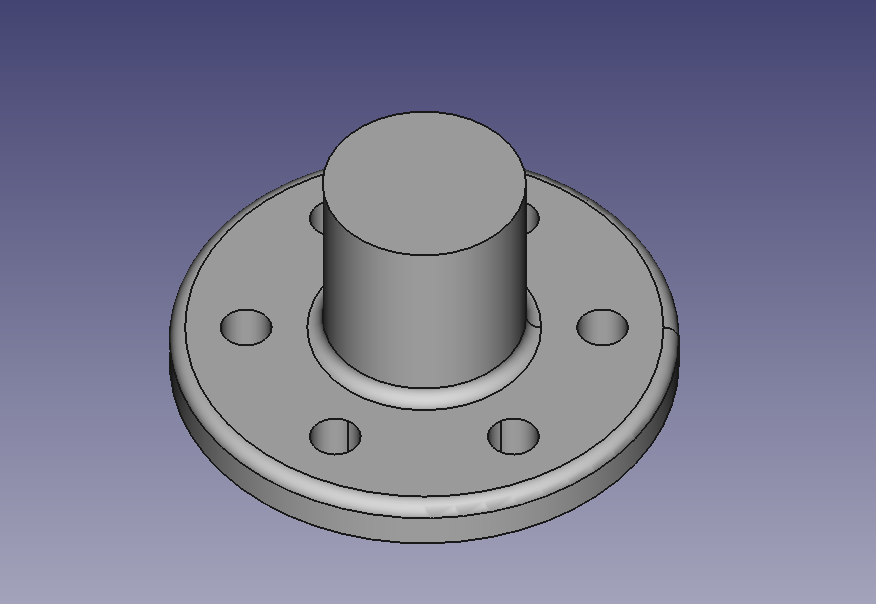

# cad3dify

Using GPT-4o (or Claude 3.5, Llama 3.2 on Vertex AI), generate a 3D CAD model (STEP file) from a 2D CAD image.

## Getting started

Installation.

```bash
git clone git@github.com:neka-nat/cad3dify.git
cd cad3dify
poetry install
```

Run script.
A STEP`file ("output.step") will be generated.

```bash
cd scripts
export OPENAI_API_KEY=<YOUR API KEY>
python cli.py <2D CAD Image File>
```

Or run streamlit spp

```bash
streamlit run scripts/app.py
streamlit run scripts/app.py -- --model_type claude  # Use Claude
```

## Demo

We will use the sample file [here](http://cad.wp.xdomain.jp/).

### Input image



### Generated 3D CAD model


